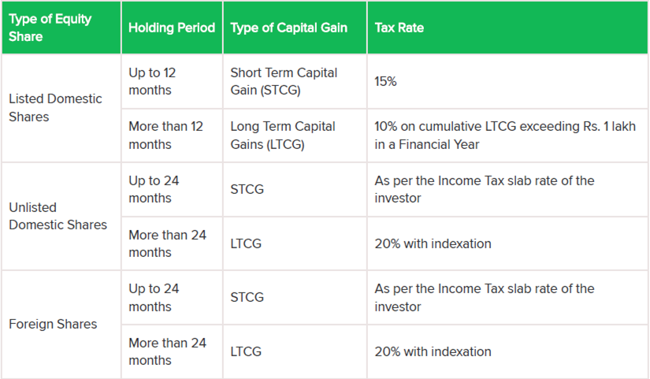

US / USD
---
ST < 24 months -- rate 
LT >= 24 months -- rate 20% + indexation 
Indexation only on LT? Yes
CII for the new year? 363

IND
---
ST < 24 months -- rate 
LT >= 24 months -- rate 20% + indexation 
Indexation only on LT? Yes
CII for the new year? 363

Long Term capital gain can be offste against Short Term losses and Long term losses
Short Term capital gain can be offste against Short Term losses

Brokerage specific

----

1Feb 2018 
    -- closing prices on 31st Jan 2018 for all listed companies acquired before this date
    -- no indexation

Grandfathering only for Indian shares

----

What happens when we liquidate securities? 
    - Bring it back to India
    - What is practically done?
    - When did this kick in?

HDFCBank sales - how to account for FIFO

---

